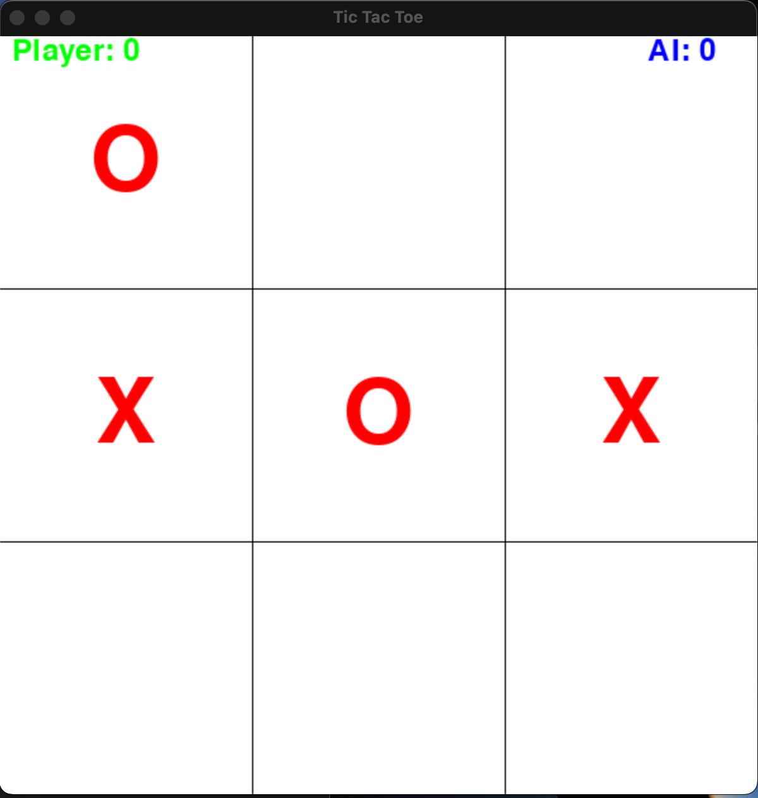

A pygame implementation of tic tac toe against an AI. Can you win?


To play, run 

```console
python play.py
```
from the parent directory. You may need to install pygame first. 

Our AI is implemented using dynamic programming. This is possible since there are not too many possible positions that can occur.



